# [Mood Swings](https://dima-bulavenko.github.io/mood_swings/index.html)

## About
Mood Swings is a web app that allows users to track and explore their daily moods. 
Users can select their mood each day and visit different "towns" based on how they 
are feeling. Each town offers a unique experience, from sharing happy notes to 
breathing exercises. Each page also displays a live word cloud showing the current 
moods of all users. Users can also view mood trends on the dashboard.

## [Live Link](https://dima-bulavenko.github.io/mood_swings/index.html)

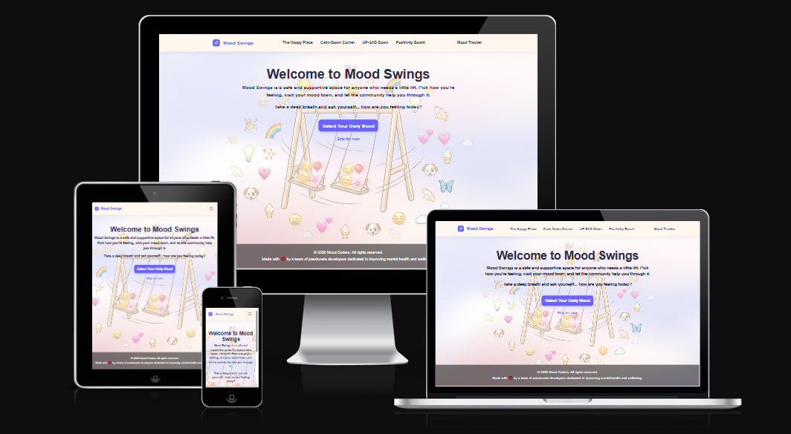

Source: [Mood Swings amiresponsive](https://fireship.dev/amiresponsive?url=https://dima-bulavenko.github.io/mood_swings/index.html)


## Wireframes
- Wireframes created using AI image generation

| Wireframe  | Implementation  |
| --------------------------------- | :------------------------------:|
| App Flow | |
| Town Map |  |

## Features
This project features a FastAPI backend with analytics engine. 
-  **Daily mood selection** - users can log their mood once per day
-  **Mood towns** - explore different towns based on your mood
  - The Happy Place - share and read notes about what made users happy
  - The UP-SAD Down - tips to help cope with sadness
  - The Calm-Down Corner - breathing exercises to help calm down
-  **Word cloud** - live word cloud showing current moods of all users
-  **Mood dashboard** - view mood trends and data insights including:
  - Most common moods among users
  - Most popular mood by day of the week
  - Personal mood history over the last 7 days
  - Most common words from happiness notes
- **Data Pipeline**: Follows a structured 7-step process including:
	- Data generation
	- EDA
	- Feature engineering
	- Model training
	- Evaluation
	- Saving
	- Wordcloud generation.
- **Data Seeding**: Load initial data from CSV file into the database using pandas.
	- The CSV serves as the data source for analysis, while the database provides persistent storage for application runtime access.
- **Models**: Implements Random Forest and XGBoost classifiers to predict:
	- User town based on mood
	- hour of day, and day of week features
	- Both achieve 100% accuracy on synthetic data.
- **Feature Engineering**
	- Converts categorical mood labels to numerical values
	- Applies MinMaxScaler normalization 
	- Splits data 80/20 for training/testing.
- **Visualizations**: Includes EDA charts
	- Bar charts
	- Heatmaps
	- Plotly interactive visualizationsa
	- Town-specific wordclouds
- **Custom 404 page**
- **User Sessions** – Anonymous session creation using UUIDs, managed via browser local storage
- **Mood Tracking** – Log 1–3 moods per day from the full set of supported mood types (see the backend `MoodType` enum / API docs)
- **Happiness Notes** – Submit notes (≤100 characters) and read others' recent notes
- **Analytics Dashboard** – API endpoints exposing mood frequency, weekly trends, top words/word frequency, and personal history

| Feature  | Implementation  |
| --------------------------------- | :------------------------------:|
| Home page | 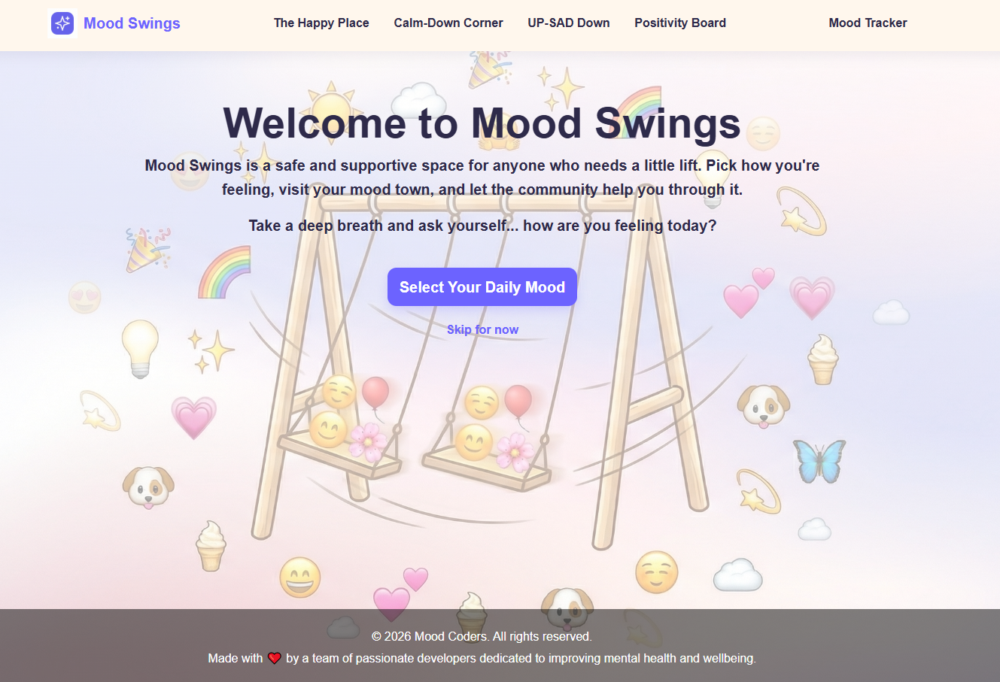 |
| Mood choices | 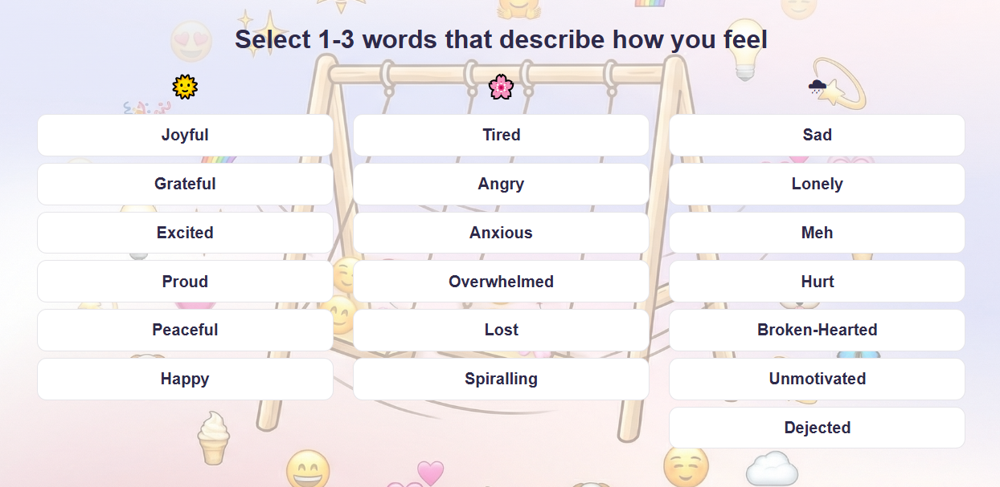 |
| The Happy Place wordcloud | 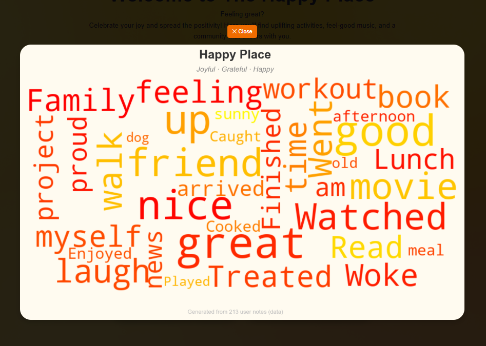 |
| Calm-Down Corner | 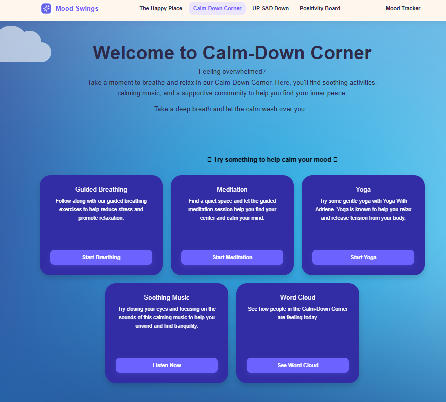 |
| Calm-Down Corner Breathing excercice | 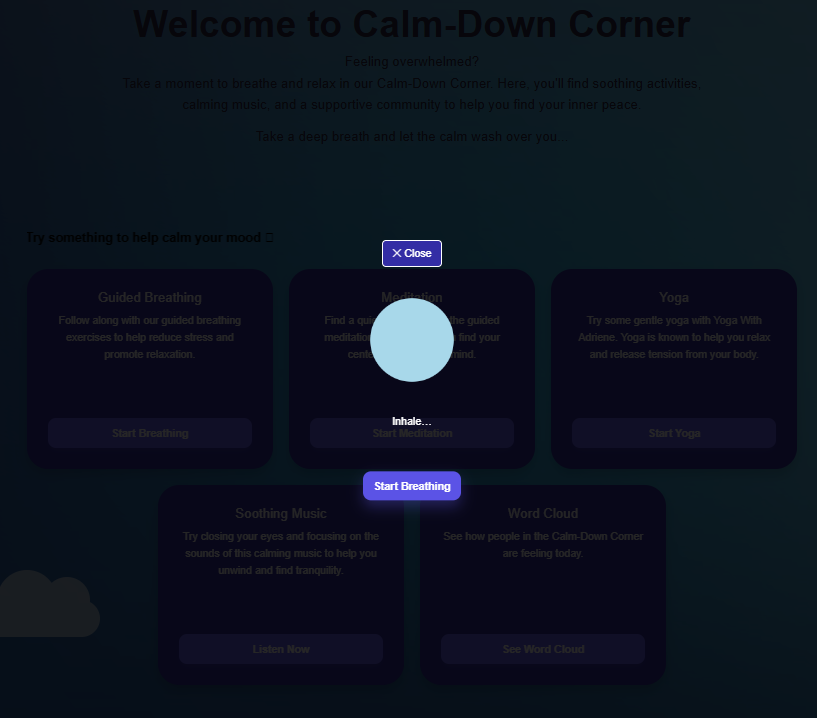 |
| Calm-Down Corner wordcloud | 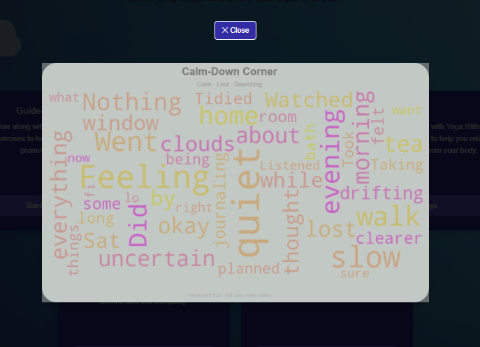 |
| UP-SAD Down | 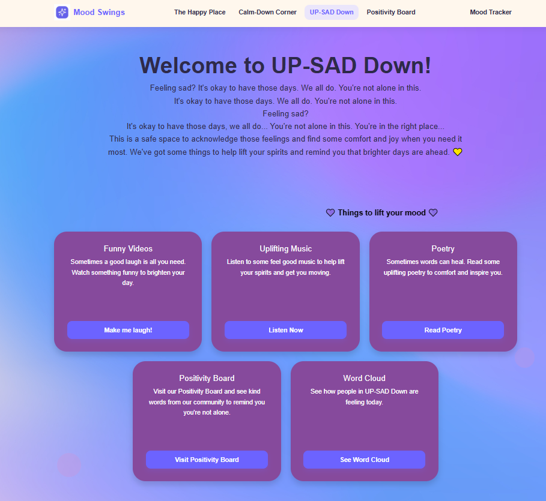 |
| UP-SAD Down funny videos| 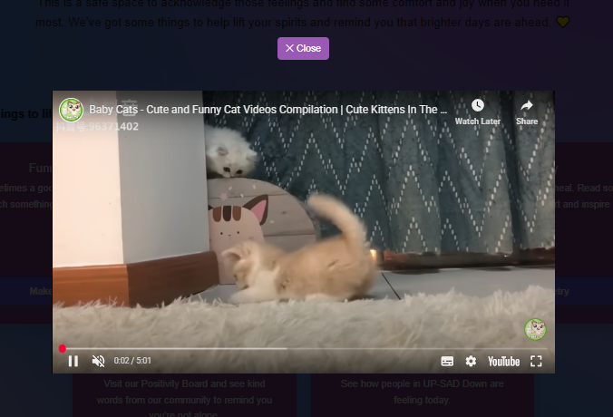 |
| UP-SAD Down wordcloud | 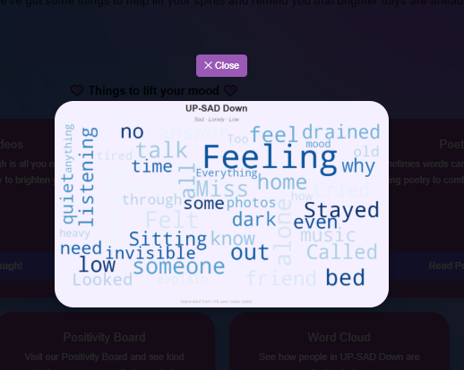 |
| Positivity Board | 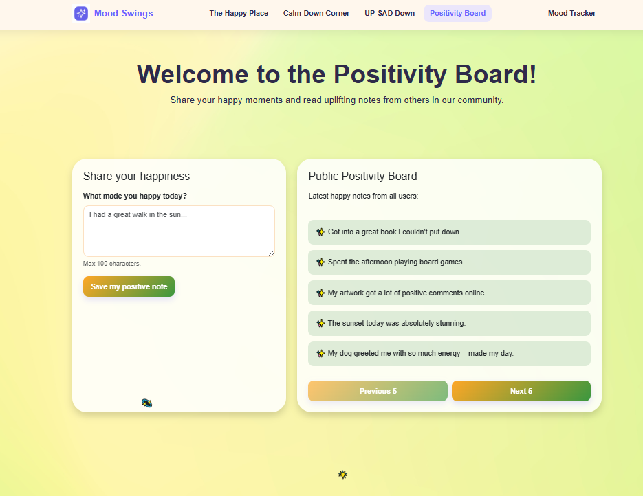 |
| Mood Tracker | 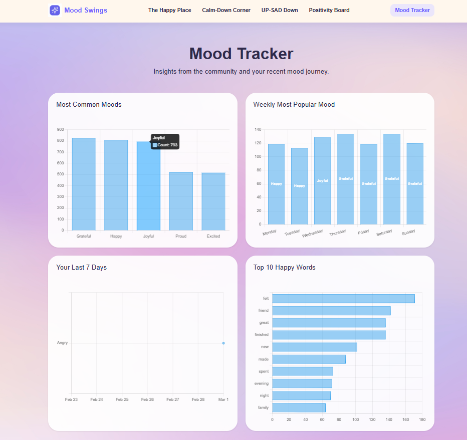 |
| Meet the team | 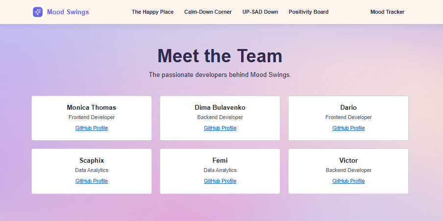 |


## Agile Development Process

### GitHub Projects

[GitHub Projects](https://github.com/users/Dima-Bulavenko/projects/15) served as an Agile tool for this project. Through it, User Stories and issues were planned, then subsequently tracked on a regular basis using the Kanban project board.

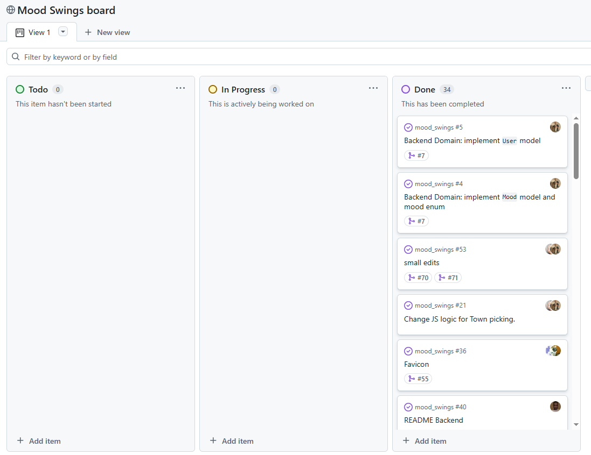

## Frontend
 ### Technologies Used
- HTML5 
- CSS3 
- JavaScript (ES6)
- Bootstrap 5

### Folder Structure
```
frontend/
├── assets/
│   ├── css/
│   │   ├── calm-town.css
│   │   ├── dashboard.css
│   │   ├── index.css
│   │   ├── happinesstown.css
│   │   └── sadness-town.css
│   ├── js/
│   │   ├── calm-town.js
│   │   ├── dashboard.js
│   │   ├── index.js
│   │   ├── happinesstown.js
│   │   ├── sadness-town.js
│   │   └── client.js
│   └── images/
├── calm-town.html
├── dashboard.html
├── index.html
├── happinesstown.html
├── sadness-town.html
└── 404.html
```
### How to Run Locally
1. Clone the repository
2. Open the `frontend` folder
3. Open `index.html` in your browser

> 💡 We recommend using the **Live Server** extension in VS Code for the best experience

# Deployment

The site is deployed using GitHub Pages. Visit the deployed site [here](https://dima-bulavenko.github.io/mood_swings/)

To Deploy the site using GitHub Pages:

1. Login (or signup) to GitHub.
2. Go to the repository for this project, [here](https://github.com/Dima-Bulavenko/mood_swings)
3. Click the settings button.
4. Select pages in the left-hand navigation menu.
5. From the Branch dropdown select main branch and press save.
6. The site has now been deployed. Please note that this process may take a few minutes before the site goes live.

### How to Fork a repository

1. On GitHub, navigate to the repository for this project, [here](https://github.com/Dima-Bulavenko/mood_swings)
2. In the top-right corner of the page, click on Fork 

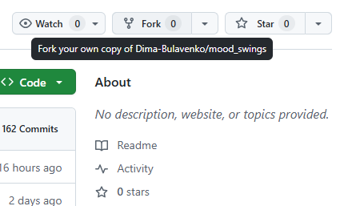


3. Select the dropdown menu and click on owner for the forked repository.
4. Click Create fork.

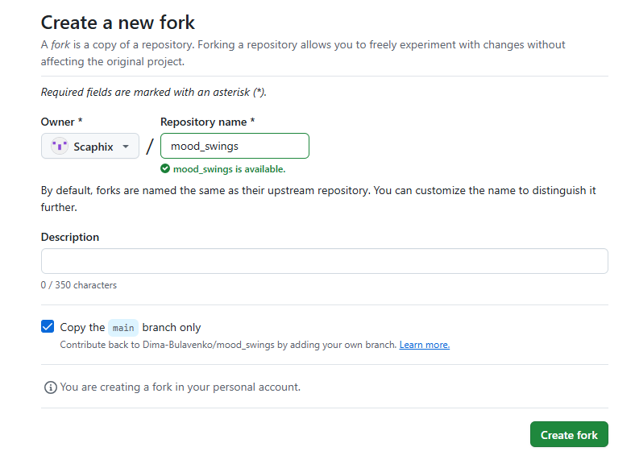

### How to Clone a repository

1. On GitHub, Go to the repository for this project, [here](https://github.com/Dima-Bulavenko/mood_swings)
2. Above the list of files, click on the code button.
3. Copy the URL for the repository.

    - To clone the repository using HTTPS, under "HTTPS", click the copy button.
    - To clone the repository using an SSH key, including a certificate issued by your organization's SSH certificate authority, click SSH, then click the copy button.
    - To clone a repository using GitHub CLI, click GitHub CLI, then click the copy button.

4. Open Terminal.
5. Change the current working directory to the location where you want the cloned directory.
6. Type git clone, and then paste the URL you copied earlier.
7. Press Enter. Your local clone will be created.

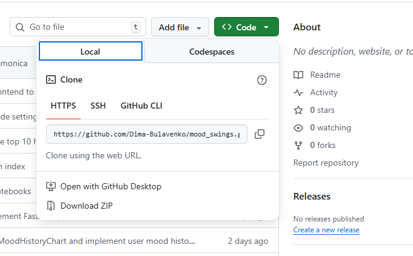

### Frontend Manual Testing

Manual testing was carried out by the frontend team across Chrome and mobile browsers to ensure all key user interactions work as expected.

| Test | Description | Result |
|------|-------------|--------|
| Navigation links | All nav links route to the correct pages | ✅ Pass |
| Buttons | All buttons trigger the correct actions | ✅ Pass |
| Responsive design | All pages display correctly on desktop and mobile screen sizes | ✅ Pass |
| Mood selection | Users can select their daily mood and are directed to the correct town | ✅ Pass |
| Breathing exercise animation | The animated breathing exercise on the Calm-Down Corner page runs correctly | ✅ Pass |
| Happiness notes form | Users can submit a happiness note (≤100 characters) and it displays correctly | ✅ Pass |

### Lighthouse Report

Performance testing was carried out using Chrome DevTools Lighthouse on the deployed site.

| Category | Score |
|----------|-------|
| Performance | 98 |
| Accessibility | 95 |
| Best Practices | 96 |
| SEO | 100 |

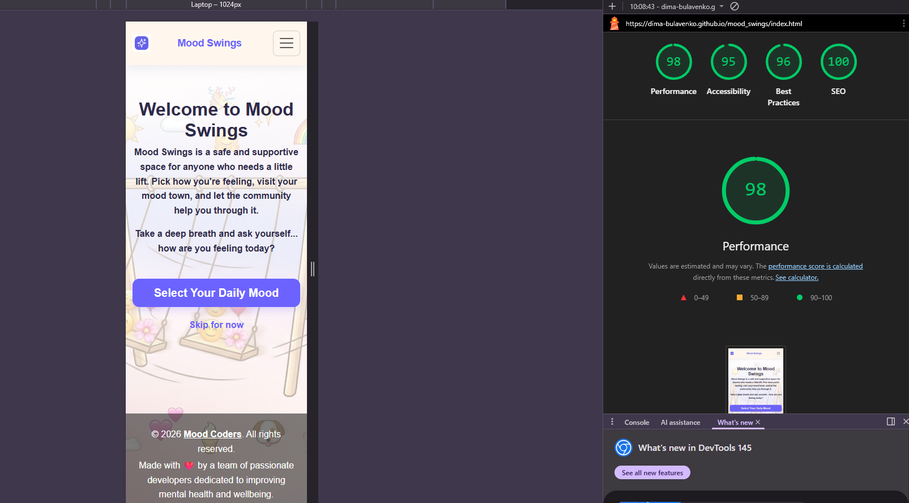

> 💡 Lighthouse scores were recorded on the deployed GitHub Pages site: [https://dima-bulavenko.github.io/mood_swings/index.html](https://dima-bulavenko.github.io/mood_swings/index.html)

## Backend
### Architecture
The backend follows a layered architecture:
- **Domain** – Core business models and DTOs
- **Infrastructure** – SQLAlchemy ORM and repositories
- **Service** – Business logic and analytics
- **API** – FastAPI routes

### Tech Stack
- Python 3.13+
- FastAPI
- SQLAlchemy
- Pydantic
- SQLite
- `uv` (dependency manager)

### Project Structure
```
backend/
├── core/domain/
├── infrastructure/sqlalchemy/
├── service/
├── main.py
├── seed_data.py
├── pyproject.toml
└── mood_swings.db  # generated at runtime
```

### API Endpoints
| Method | Endpoint | Description |
|--------|----------|-------------|
| POST | `/users` | Create anonymous session |
| POST | `/moods?user_id=` | Create today's mood |
| GET | `/moods/today?user_id=` | Retrieve today's mood |
| PUT | `/moods/today?user_id=` | Update today's mood |
| POST | `/notes?user_id=` | Create happiness note |
| GET | `/notes/latest?user_id=` | Get 5 most recent notes from other users |
| GET | `/mood-frequency` | Top 5 moods |
| GET | `/weekly-trend` | Mood by weekday |
| GET | `/top-happy-words` | Top 10 words |
| GET | `/user-history?user_id=` | 7-day mood history |

### Overview
This module implements a comprehensive data analytics and machine learning pipeline for the Mood Swings project, handling synthetic mood data from 700 records (50 users × 14 days) stored in SQLite database and CSV format.

### Database Overview
- **Database File**: `mood_swings.db` (SQLite)
- **Purpose**: Persistent storage and querying of mood records
- **Data Source**: Mirrors `data/mood_swing_data.csv`

**Table: moods**
| Column      | Type       | Description                                          |
| ----------- | ---------- | ---------------------------------------------------- |
| id          | INTEGER PK | Unique record identifier                             |
| user_id     | INTEGER    | References user account                              |
| mood        | TEXT       | Mood classification: `"happy"`, `"sad"`, or `"calm"` |
| tags        | TEXT       | Optional additional labels relating to the mood      |
| town_name   | TEXT       | Geographic location associated with the mood         |
| note        | TEXT       | Optional user comments                               |
| hour_of_day | INTEGER    | Hour of the day (0–23)                               |
| day_of_week | INTEGER    | Day of the week (0 = Sunday, 6 = Saturday)           |
| timestamp   | DATETIME   | Recording date and time                              |

### Installation & Setup
Install dependencies and initialize the database with the following steps:
1. Install required packages
2. Import SQLAlchemy base models
3. Create database engine connection
4. Generate all tables from model definitions

### Output Artifacts
- Training data: `data/mood_swing_data.csv`
- Trained model: `mood_model.joblib`
- Wordclouds: `assets/wordclouds/{calm-down_corner, happy_place, up-sad_down}.png`

### Tech Stack
Python (Pandas, Scikit-learn, XGBoost, Plotly, WordCloud)

 ## Future Enhancements
- Sentiment analysis
- Time-series modeling
- API productionization.
- JWT/OAuth authentication
- Docker deployment
- PostgreSQL
- Unit tests
- Rate limiting

## Credits & Acknowledgements
This project was built by the Mood Coders team:
- [Monica] — Frontend
- [Dario] — Frontend
- [Dima] — Backend
- [Victor] — Backend
- [Femi] — Data
- [Chahinez] — Data

### Images

This project utilizes visual assets from the following sources:

Background Textures: All general background images were sourced via iStock.

Homepage Illustration: The main cartoon background was refined and edited using Gemini’s image editing tools to ensure visual consistency and style alignment across the project.

### Resources & Links
- [Bootstrap 5](https://getbootstrap.com/)
- [Chart.js](https://www.chartjs.org/)
- You Tube
- Spotify
